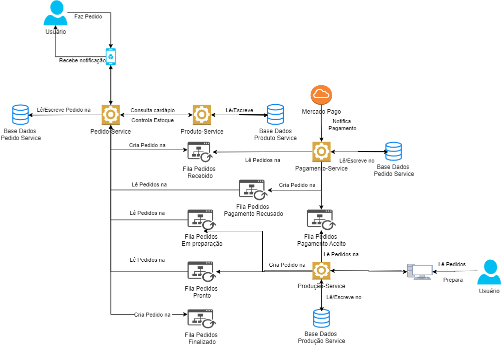

# Descrição do Fluxo SAGA para Pedido

## Visão Geral
Este documento descreve a arquitetura e o fluxo do padrão SAGA aplicado ao sistema de pedidos de uma lanchonete. O fluxo envolve a criação do pedido, processamento do pagamento e preparação do pedido na cozinha, utilizando o padrão SAGA coreografado.

## Componentes Principais
1. **Usuário**
   - Representado como um ícone de usuário, que inicia a interação.
2. **Mobile Services**
   - Representa o serviço de interface móvel usado pelo usuário para interagir com o sistema.
3. **Consulta Catálogo**
   - Indica a ação de consultar o catálogo de produtos.
   - Repositório do [Produto-Service](https://github.com/ChristianS0ares/nuget-fiap-app-produto).
4. **Pedido-Service**
   - Serviço responsável por criar e gerenciar pedidos.
   - Repositório do [Pedido-Service](https://github.com/ChristianS0ares/nuget-fiap-app-pedido).
5. **Pagamento-Service**
   - Serviço responsável pelo processamento dos pagamentos.
   - Repositório do [Pagamento-Service](https://github.com/ChristianS0ares/nuget-fiap-app-pagamento).
6. **Cozinha-Service**
   - Serviço responsável pela preparação dos pedidos na cozinha.
   - Repositório do [Acompanhamento-Service](https://github.com/ChristianS0ares/nuget-fiap-app-producao).

## Fluxo Detalhado do Processo

### Iniciação do Pedido
- O cliente cria um pedido através do sistema de autoatendimento.
- A interface móvel consulta o catálogo de produtos disponíveis.

### Criação do Pedido
- Após a seleção dos produtos, o pedido é criado no `Pedido-Service`.
- O `Pedido-Service` publica um evento `PedidoCriado`.

### Processamento do Pagamento
- O `Pagamento-Service` escuta o evento `PedidoCriado`.
- O `Pagamento-Service` processa o pagamento usando o QRCode do Mercado Pago.
- Se o pagamento for bem-sucedido:
  - O `Pagamento-Service` publica um evento `PagamentoAprovado`.
  - O `Pedido-Service` atualiza o estado do pedido para `Pagamento Confirmado`.
- Se o pagamento falhar:
  - O `Pagamento-Service` publica um evento `PagamentoFalhou`.
  - O `Pedido-Service` atualiza o estado do pedido para `Pagamento Falhou` e notifica o cliente.

### Envio para Cozinha
- O `Cozinha-Service` escuta o evento `PagamentoAprovado`.
- O `Cozinha-Service` recebe os detalhes do pedido e inicia a preparação.
- O `Cozinha-Service` publica um evento `PedidoEmPreparacao`.

### Acompanhamento e Finalização do Pedido
- O cliente pode acompanhar o status do pedido através de um monitor que exibe os seguintes estados: `Recebido`, `Em Preparação`, `Pronto` e `Finalizado`.
- Quando o pedido é preparado, o `Cozinha-Service` publica um evento `PedidoPronto`.
- O cliente é notificado que o pedido está pronto para retirada.
- Após a retirada, o `Pedido-Service` atualiza o estado do pedido para `Finalizado`.

## Justificativa do Padrão SAGA Coreografado

### Razões para Escolha

1. **Eventos Distribuídos**
   - Cada serviço publica eventos e outros serviços reagem a esses eventos, promovendo a independência entre os serviços.

2. **Autonomia dos Serviços**
   - Cada serviço sabe o que fazer quando um evento é recebido, permitindo que cada serviço gerencie suas próprias transações.

3. **Descentralização**
   - Não há um único ponto de controle que gerencia a transação, eliminando um ponto único de falha e permitindo uma escalabilidade melhor.

### Benefícios

- **Escalabilidade**
  - A arquitetura distribuída facilita o escalonamento horizontal dos serviços, melhorando a capacidade de lidar com grandes volumes de pedidos.

- **Resiliência**
  - A ausência de um orquestrador central reduz o risco de falhas catastróficas e permite que os serviços continuem operando independentemente.

- **Flexibilidade**
  - A adição ou modificação de serviços pode ser feita com menor impacto na arquitetura geral, já que os serviços se comunicam por eventos.

Esta abordagem garante que todas as etapas do pedido, desde a criação até a preparação, sejam gerenciadas de maneira coordenada e eficiente, mantendo a consistência e integridade dos dados através do sistema distribuído.
